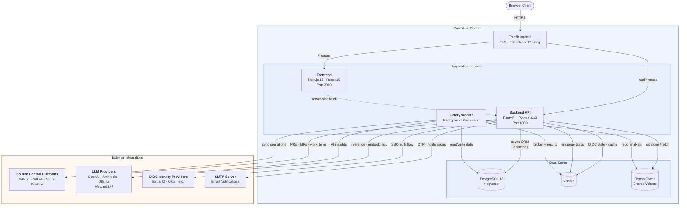
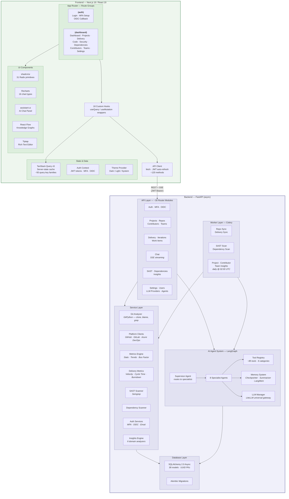
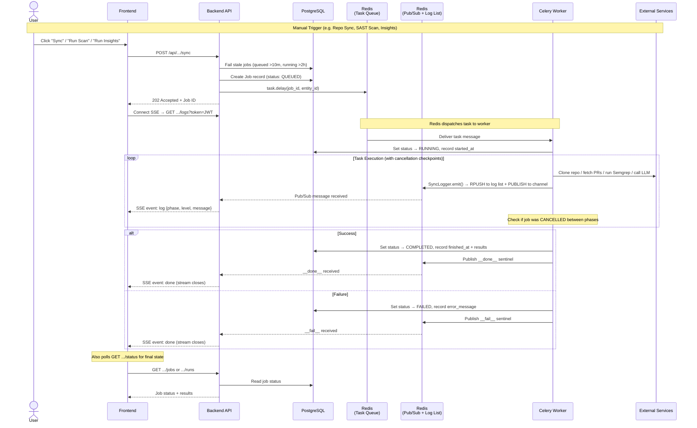
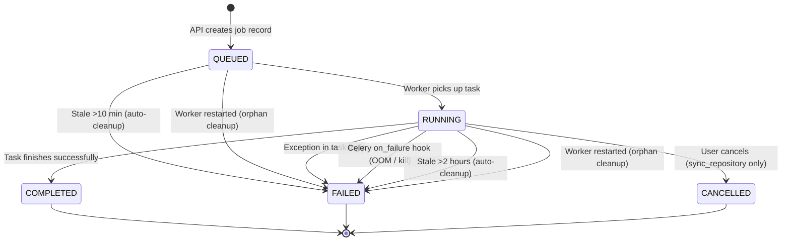

# Contributr Architecture

## 1. High-Level System Architecture

**Component summary:**

| Component | Technology | Role |
|-----------|-----------|------|
| **Traefik Ingress** | Traefik (K8s) | TLS termination, path-based routing (`/api/*` → backend, `/*` → frontend) |
| **Frontend** | Next.js 16, React 19, TypeScript | SPA with App Router, shadcn/ui, Recharts, AI chat panel |
| **Backend API** | FastAPI, async Python 3.13 | REST API + SSE streaming, auth, agent orchestration |
| **Celery Worker** | Celery 5.6 + Redis broker | Git sync, SAST/dependency scans, AI insight generation (daily at 02:00 UTC) |
| **PostgreSQL** | pgvector/pgvector:pg18 | Primary data store, vector embeddings for AI memory (pgvector) |
| **Redis** | Redis 8 Alpine | Celery broker/results, OIDC state, OTP codes |
| **Repos Cache** | Shared PVC (100 Gi) | Bare-mirror git clones shared between backend and worker |

---

## 2. Frontend & Backend Internal Architecture

**Frontend architecture highlights:**

| Layer | Purpose |
|-------|---------|
| **App Router** | Two route groups: `(auth)` for login/MFA and `(dashboard)` for all authenticated pages |
| **Hooks** | 18 custom hooks wrapping every API call in TanStack Query for caching and mutations |
| **API Client** | Centralized `fetch`-based client with automatic JWT refresh and session expiry handling |
| **UI Components** | shadcn/ui primitives, Recharts for data viz, assistant-ui for AI chat, React Flow for graphs |
| **State** | Server-state-first via TanStack Query; React Context for auth and theme only |

**Backend architecture highlights:**

| Layer | Purpose |
|-------|---------|
| **API Layer** | ~30 FastAPI router modules covering auth, projects, delivery, chat, scans, and admin |
| **Service Layer** | Business logic — git analysis, platform API clients, metrics computation, security scanning |
| **Agent System** | LangGraph-based multi-agent supervisor pattern with 8 specialist agents and ~85 tools |
| **Database** | SQLAlchemy 2.0 async with 38 models, pgvector for AI memory embeddings |
| **Worker** | Celery tasks for repo sync, SAST/dep scanning, and AI insights (daily scheduled) |

**AI Agent architecture:**

| Component | Detail |
|-----------|--------|
| **Supervisor** | Routes user questions to the appropriate specialist agent |
| **Specialists** | Contribution Analyst, Delivery Analyst, Code Reviewer, Text-to-SQL, SAST Analyst, Insights Analyst, Contributor Coach, Delivery-Code Analyst |
| **Tools** | Self-registering tool categories: contribution analytics (25), delivery analytics (~30), code access (9), SAST analytics (12), dependency analytics (6), SQL query (3) |
| **Memory** | 3-tier: checkpoint persistence, conversation summarization, long-term vector memory via LangMem + pgvector |
| **LLM Manager** | LiteLLM-based universal gateway supporting any provider (OpenAI, Anthropic, Azure, Ollama, etc.) |

---

## 3. Background Job & Worker Architecture

### End-to-end flow: trigger → enqueue → process → notify

### Task catalog, triggers, and cascading

```mermaid
flowchart TD
    subgraph triggers["Trigger Sources"]
        manual["<b>User Action</b><br/>via Frontend UI"]
        beat["<b>Celery Beat</b><br/>cron: daily @ 02:00 UTC"]
        cascade_trigger["<b>Task Cascade</b><br/>post-completion of parent task"]
    end

    subgraph apiLayer["Backend API — Task Dispatch"]
        api_sync["POST /repositories/{id}/sync<br/><i>Creates SyncJob (QUEUED)</i>"]
        api_del["POST /projects/{id}/delivery/sync<br/><i>Creates DeliverySyncJob (QUEUED)</i>"]
        api_sast["POST /repositories/{id}/sast/scan<br/><i>Creates SastScanRun (QUEUED)</i>"]
        api_dep["POST /repositories/{id}/dependencies/scan<br/><i>Creates DepScanRun (QUEUED)</i>"]
        api_pi["POST /projects/{id}/insights/run<br/><i>Creates InsightRun (RUNNING)</i>"]
        api_ci["POST /contributors/{id}/insights/run<br/><i>Creates ContributorInsightRun</i>"]
        api_ti["POST /projects/{id}/teams/{id}/insights/run<br/><i>Creates TeamInsightRun</i>"]
    end

    subgraph redis["Redis — Celery Broker"]
        queue[("Task Queue")]
    end

    subgraph worker["Celery Worker — Task Execution"]
        t_sync["<b>sync_repository</b><br/>Clone/fetch repo · extract commits<br/>Fetch PRs/MRs · rebuild stats<br/>Link work items"]
        t_del["<b>sync_delivery</b><br/>Fetch Azure DevOps teams<br/>iterations · work items · activities<br/>Rebuild delivery stats"]
        t_sast["<b>run_sast_scan</b><br/>Run Semgrep with rule profile<br/>Persist findings"]
        t_dep["<b>run_dependency_scan</b><br/>Scan manifests for vulnerabilities<br/>Persist findings"]
        t_sched["<b>schedule_all_project_insights</b><br/>Fan-out: create InsightRun per project"]
        t_pi["<b>run_project_insights</b><br/>Run 6 domain analyzers<br/>AI enhancement · persist findings"]
        t_ci["<b>run_contributor_insights</b><br/>Per-contributor analysis<br/>Agentic AI root-cause investigation"]
        t_ti["<b>run_team_insights</b><br/>Per-team analysis<br/>AI enhancement · persist findings"]
    end

    subgraph feedback["Real-Time Feedback"]
        sse["SSE Log Stream<br/><i>Redis Pub/Sub → EventSource</i>"]
        poll["REST Polling<br/><i>GET .../jobs or .../runs</i>"]
    end

    %% Manual triggers
    manual --> api_sync & api_del & api_sast & api_dep & api_pi & api_ci & api_ti

    %% API dispatches to Redis
    api_sync -->|".delay()"| queue
    api_del -->|".delay()"| queue
    api_sast -->|".delay()"| queue
    api_dep -->|".delay()"| queue
    api_pi -->|".delay()"| queue
    api_ci -->|".delay()"| queue
    api_ti -->|".delay()"| queue

    %% Beat schedule
    beat -->|"schedule_all_project_insights"| queue

    %% Redis dispatches to worker
    queue --> t_sync & t_del & t_sast & t_dep & t_sched & t_pi & t_ci & t_ti

    %% Task cascading
    t_sync -->|"if auto_sast_on_sync"| cascade_trigger
    t_sync -->|"if auto_dep_scan_on_sync"| cascade_trigger
    cascade_trigger -->|"run_sast_scan.delay()"| queue
    cascade_trigger -->|"run_dependency_scan.delay()"| queue

    %% Fan-out
    t_sched -->|"N × run_project_insights.delay()"| queue

    %% All workers emit feedback
    t_sync --> sse
    t_del --> sse
    t_sast --> sse
    t_dep --> sse
    t_pi --> sse
    t_ci --> sse
    t_ti --> sse
    sse -->|"live logs"| poll

    style triggers fill:#fff8f0,stroke:#d4915c,stroke-width:2px
    style apiLayer fill:#f0f4ff,stroke:#4a6fa5,stroke-width:2px
    style redis fill:#fef0f0,stroke:#c55a5a,stroke-width:2px
    style worker fill:#f0f0fa,stroke:#5c5c9c,stroke-width:2px
    style feedback fill:#eef6ee,stroke:#4a8c5c,stroke-width:2px
```

### Job lifecycle and failure protection

**Task trigger reference:**

| Task | Trigger | Cascade From | SSE Log Key |
|------|---------|-------------|-------------|
| `sync_repository` | `POST /repositories/{id}/sync` | — | `sync:logs:{job_id}` |
| `sync_delivery` | `POST /projects/{id}/delivery/sync` | — | `sync:logs:delivery-{project_id}` |
| `run_sast_scan` | `POST /repos/{id}/sast/scan` or auto | `sync_repository` (if `auto_sast_on_sync`) | `sync:logs:sast-{scan_id}` |
| `run_dependency_scan` | `POST /repos/{id}/dependencies/scan` or auto | `sync_repository` (if `auto_dep_scan_on_sync`) | `sync:logs:dep-{scan_id}` |
| `schedule_all_project_insights` | Celery Beat (daily 02:00 UTC) | — | — |
| `run_project_insights` | `POST /projects/{id}/insights/run` or beat fan-out | `schedule_all_project_insights` | `sync:logs:insights-{run_id}` |
| `run_contributor_insights` | `POST /contributors/{id}/insights/run` | — | `sync:logs:contributor-insights-{run_id}` |
| `run_team_insights` | `POST /projects/{id}/teams/{id}/insights/run` | — | `sync:logs:team-insights-{run_id}` |

**Failure protection layers:**

| Layer | Mechanism | Scope |
|-------|-----------|-------|
| **In-task try/except** | Catches exceptions, sets FAILED + error message | All tasks |
| **Celery `on_failure` hook** | Catches worker-level crashes (OOM, SIGKILL) | `sync_repository`, `sync_delivery`, `run_dependency_scan` |
| **Worker startup cleanup** | Fails orphaned QUEUED/RUNNING jobs on restart | `SyncJob`, `DeliverySyncJob` |
| **Stale job detection** | Auto-fails stuck jobs when a new run is triggered | All job types (10 min / 2 hr thresholds) |
| **Graceful cancellation** | User-initiated cancel with `celery.control.revoke()` + DB checkpoints | `sync_repository` only |

**Real-time feedback mechanism:**

Each task writes structured logs via `SyncLogger`, which dual-writes to a **Redis LIST** (for replay on late-joining clients) and a **Redis Pub/Sub channel** (for live streaming). The frontend connects to a per-task SSE endpoint that replays buffered logs then streams live updates. Log entries expire after 1 hour. A `__done__` sentinel signals stream termination.
